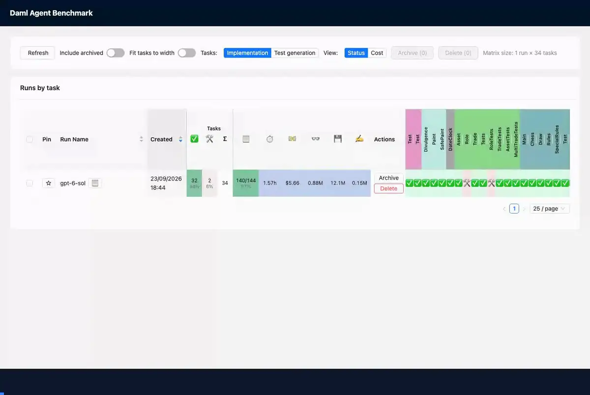

# Daml Agent Benchmark

A benchmark for **agentic Daml code generation**. Each task takes one test file from a real Daml repository and empties the implementation files that the test exercises. A coding agent, running in an isolated container, has to write those files again so that the test passes. The harness grades the result with the Daml linter, `daml build` and `daml test`, and a web dashboard shows every run down to the agent's individual steps.



Part of the [Daml Code Assistant](https://github.com/canton-foundation/canton-dev-fund/blob/main/proposals/2026-06-IEU-Daml%20Code%20Assistant.md) project.

## What the numbers mean

For each run the benchmark reports:

- **Test-suite pass rate**: tasks whose whole test file passes.
- **Individual-test pass rate**: test scripts that pass, over all tasks. A Daml test file usually contains several test scripts.
- **Build success rate**: tasks whose package builds.
- **Syntax-error-free rate**: tasks whose implementation files lint without errors.
- **Cost and runtime per task**: the agent's API cost in US dollars and its wall time.

Grading runs in three stages, syntax, build and tests, and each stage runs only when the one before it passed. So the test-suite pass rate is at most the build success rate, which is at most the syntax-error-free rate.

The pass rates leave out every task with an infrastructure failure, a failure that the agent did not cause, and every task with a security finding. The dashboard's outcome columns count all tasks, so the two differ when a run has such tasks.

A task whose build failed ran no test scripts. It counts towards the individual-test denominator only when the ground-truth control (see [How a task runs](docs/how-it-works.md)) ran for it, so turn the control on when you report that number.

Cost is priced per request to the model, with prices from the [`genai-prices`](https://pypi.org/project/genai-prices/) package.

## The tasks

The package ships 34 tasks from six public repositories, all licensed under Apache-2.0: `daml`, `daml-finance`, `splice`, `canton`, `ex-models` and `account-hierarchy`. [The tasks](docs/tasks.md) explains how a task is built and gives the pinned commit of each repository.

## Requirements

- **Docker.** Every task runs in containers. The runner starts Docker when it is not running, and stops it when the run ends only if the runner started it (see [Running experiments](docs/running.md#what-a-run-does-to-docker)).
- **Emulation on Apple Silicon.** The task image is `linux/amd64`, because the Daml SDK ships x86_64 Linux builds only. On Apple Silicon, Docker runs it under emulation, which is slower.
- **An API key for the model's provider**, in an environment variable. The default provider is OpenAI, with the key in `OPENAI_API_KEY`. The agent is the Codex CLI, installed in the task image at a pinned version, so the host needs no Codex install.
- **Python 3.12 or later** and [uv](https://docs.astral.sh/uv/).
- **git**, to fetch the source repositories.
- **Node.js**, for the dashboard. The server builds the page with npm on its first start.
- **About 12 GB of disk.** The Daml SDK versions that the tasks use take about 10 GB, the container images about 2 GB, and the source repositories under 1 GB.

Some repositories need host tools while their copies are prepared:

- `account-hierarchy`, `daml` and `splice` need the Daml assistant (`curl -sSL https://get.daml.com/ | sh`). The assistant is an x86_64 program, so on Apple Silicon it needs Rosetta 2 (`softwareupdate --install-rosetta --agree-to-license`). A macOS upgrade can leave Rosetta out, and the assistant then fails with "bad CPU type in executable".
- `daml-finance` needs `make`, `curl` and `yq`.
- Repositories with an `.envrc`, such as `splice`, have it read with [direnv](https://direnv.net/) when direnv is installed.

## Quick start

Install the package and its dependencies into `.venv`:

```bash
uv sync
```

Fetch a source repository. With no names it fetches all six, at the commits that the tasks were written against. They go into `sources/`, which is where the harness looks for them:

```bash
uv run python -m daml_agent_benchmark.fetch_sources ex-models
```

Run one task. The example experiment file runs `ex-models/tic-tac-toe/daml/Test.daml` with a five-minute limit:

```bash
export OPENAI_API_KEY=sk-...
cp experiment.example.py experiment.py
uv run python -m daml_agent_benchmark.runner
```

The first run takes longer. It builds the container images and installs the Daml SDK versions that the task needs, into `~/daml-sdk-store`. Later runs reuse them.

Open the dashboard at http://127.0.0.1:8010:

```bash
uv run python -m daml_agent_benchmark.server
```

When port 8010 is taken, pick another one with `--port`, for example `--port 8011`.

To run the whole benchmark, fetch all repositories and set `task_set="all"` in the experiment file. [Running experiments](docs/running.md) covers the settings.

## Evaluating other models, tools and tasks

**Other models.** Any model that a provider serves through the OpenAI Responses API works. [The section "Another model provider" in running.md](docs/running.md#another-model-provider) shows the settings.

**Additional tools.** Give the agent a [skill](docs/running.md#giving-the-agent-a-skill), or allow remote [MCP servers](docs/running.md#mcp-servers) by name. Run the same tasks with and without them, and compare the runs in the dashboard.

**Additional tasks.** Tasks from other Daml repositories, private ones included, can be added without changing the harness, as [Adding tasks](docs/tasks.md#adding-tasks) explains.

## Integrity checks

- **The answer is not in the sandbox.** The copy leaves out git history, neighbouring packages that duplicate the answer and prebuilt archives that contain it. Every copy is scanned for the answer before the agent sees it.
- **The agent cannot leave the sandbox.** Each container drops all Linux capabilities and sits on a private network whose only way out is a proxy that allows only the model provider and allowed MCP servers.
- **Only the target files count.** Only the implementation files are copied back, and grading uses the untouched test file.
- **Infrastructure failures are not scored.** A task that fails for reasons outside the agent is flagged and left out of the pass rates.
- **The checks are tested.** In red-team runs on the public tasks, the agent searched its own sandbox for the answer and found no leak in any of 17 clean sandboxes. It found a planted copy in 16 of 17 others.

[How a task runs](docs/how-it-works.md) explains each check.

## Code layout

```
src/daml_agent_benchmark/
├── runner.py            # the command that runs experiments
├── config.py            # the settings that an experiment can change
├── locations.py         # where the harness finds the source repositories and writes its logs
├── fetch_sources.py     # fetches the source repositories at their pinned commits
├── tasklist/            # the task list, and the source repositories that it uses
├── repos/               # repository-specific steps that make a copy build
├── task_run/            # one task: copying, checks, the agent's run and grading
├── container/, docker/  # the container images and the network proxy
├── records.py           # the format of what a run writes to logs/<run id>/
├── pricing.py           # the cost of each request to the model
├── redteam.py           # red-team runs that search a sandbox for leaked answers
└── server/              # the dashboard's web server
frontend/                # the dashboard's web page (React)
experiment.example.py    # example experiments to copy and edit
```

## Documentation

- [The tasks](docs/tasks.md): how a task is built, the source repositories, task ids and adding tasks.
- [Running experiments](docs/running.md): experiment files, the main settings, other providers, MCP servers, skills and machine sizing.
- [How a task runs](docs/how-it-works.md): one task from repository copy to grade, and what keeps the result honest.

## Baselines

The baseline is OpenAI's `gpt-6-sol`, run through the Codex CLI with the package's defaults: no skill, no MCP servers and no extra prompt guidance, 10 minutes per task, and network access to the model provider only.

| Task set | Tasks | Syntax passes | Builds | Tests pass |
|---|---|---|---|---|
| Public (this package) | 34 | 34 | 32 | **32 (94%)** |
| Private | 52 | 52 | 45 | **41 (79%)** |
| All | 86 | 86 | 77 | **73 (85%)** |

The private tasks come from 10 private repositories. They were run with the same harness and settings, and only their totals are given here. The 34 public tasks cost $5.66 in API usage, and the median task took about two minutes.

[`baselines/gpt-6-sol/`](baselines/gpt-6-sol) holds the records of the 34 public tasks: each task's grade, the files the agent wrote, the agent's full event stream, the log of the wrapper that runs the agent, and the harness's log of the task. To browse them in the dashboard, copy the folder into `logs/` (`cp -R baselines/gpt-6-sol logs/`) and start the dashboard.

`docs/media.py` makes the recording at the top from the shipped baseline. Run it again after changing the dashboard.

## License

Licensed under the [Apache License, Version 2.0](LICENSE). The source repositories are not redistributed here. See [`NOTICE`](NOTICE) for their attribution.
